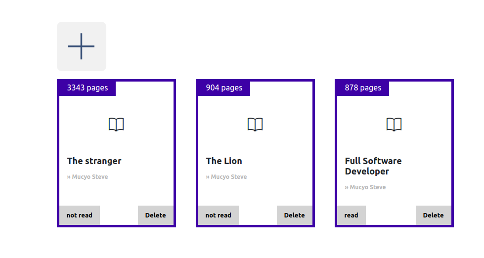

# Library v1.1

> In this project, we built a mini library, where users can add new books alongside its author, title and number of pages.
Some of the features also include marking as read or unread and deleting a book.

> 

## Built With

- HTML
- CSS3
- JAVASCRIPT
- SASS

## Live Demo

[Live Demo Link](https://raw.githack.com/rukundoeric/library_v1.1/ft-library/src/index.html)

## Getting Started

- Clone this repo https://github.com/rukundoeric/library_v1.1/tree/ft-library
- Navigate to project directory.
- If you have liveserver in you vs-code, just run it.
- Ortherwise just open index page with your browser.

## Authors

👤 **Rukundo Eric**

- GitHub: [@githubhandle](https://github.com/rukundoeric)
- Twitter: [@twitterhandle](https://twitter.com/rukundoeric005)
- LinkedIn: [LinkedIn](https://www.linkedin.com/in/rukundo-eric-000bba181/)

👤 **Elijah Ayandokun**

- GitHub: [@elijahtobs](https://github.com/elijahtobs)
- Twitter: [@elijahtobs](https://twitter.com/elijahtobs)
- LinkedIn: [LinkedIn](https://www.linkedin.com/in/ayandokunelijah/)

## 🤝 Contributing

Contributions, issues, and feature requests are welcome!

Feel free to check the [issues page](https://github.com/rukundoeric/library_v1.1/issues).

## Show your support

Give a ⭐️ if you like this project!

## Acknowledgments

- I would like to thank Cindy Shin for providing the sketch Design of this project.
- I would like to thank our code reviewer and anyone else who participated in making this done.

## 📝 License

This project is [MIT](./LICENCE) licensed.